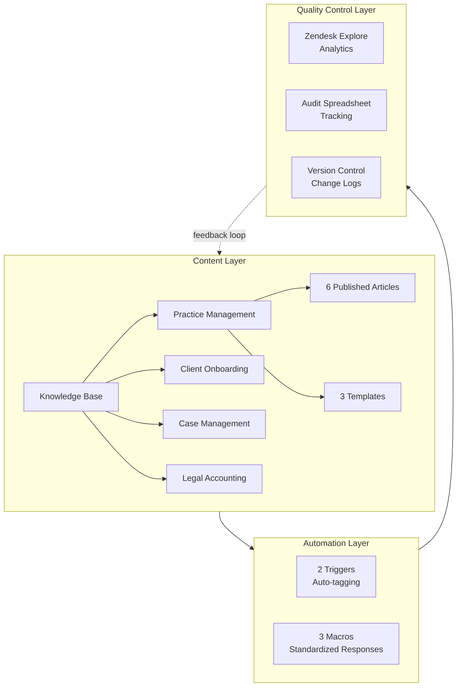
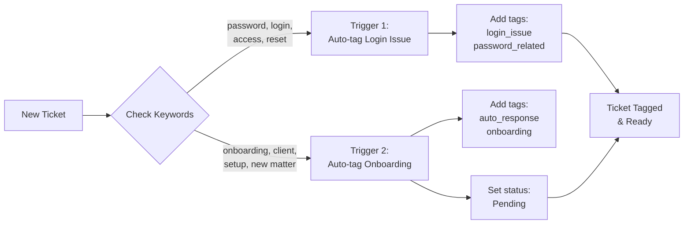
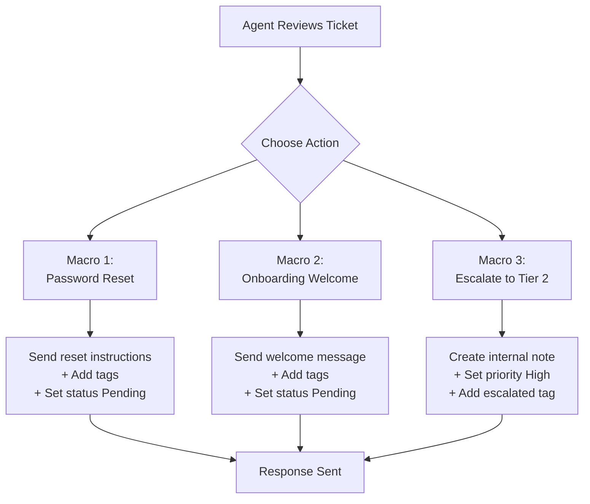
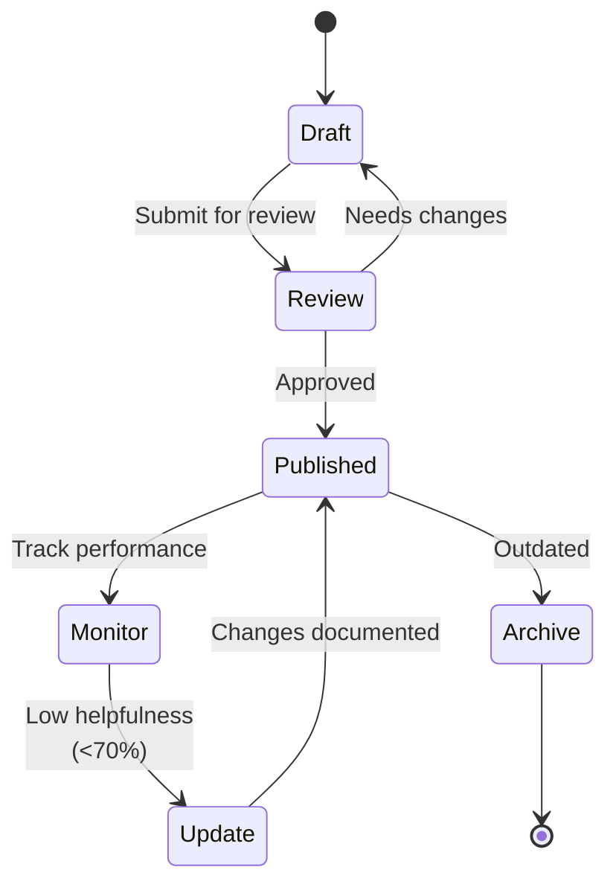
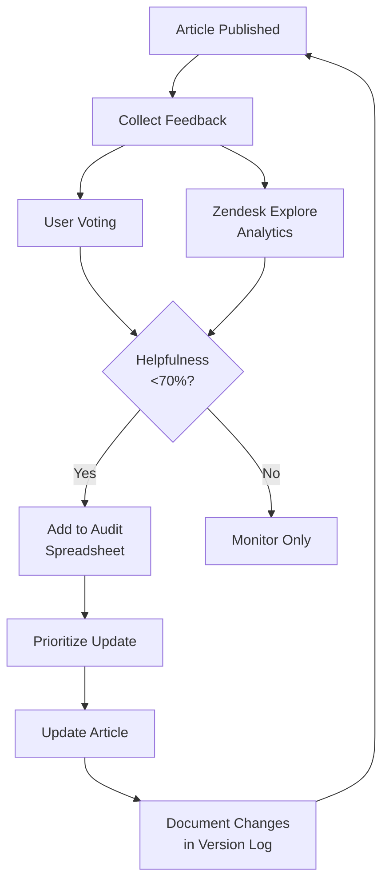

*Note: Live demo available during trial period. Screenshots provided below for reference.*

# Screenshots
## Macro

## Triggers

## Others



---
## Video Tutorial Sample

<iframe src="https://www.loom.com/embed/0bbf00ec13a64c67bcf03e0725742b22" frameborder="0" webkitallowfullscreen mozallowfullscreen allowfullscreen style="position: absolute; top: 0; left: 0; width: 100%; height: 100%;"></iframe>

# Project Overview

Built a complete knowledge base in Zendesk, demonstrating technical writing and knowledge management skills for legal practice management software.

---

# Features

### Content Management
- 6 published articles across 4 legal tech categories
- 3 reusable templates with consistent structure
- Label taxonomy and permission controls
- Version control with change documentation

### Automation
- 3 macros for standardized responses
- 2 triggers for intelligent routing
- Keyword-based auto-tagging

### Analytics & Quality
- Zendesk Explore configured for performance monitoring
- Article voting for user feedback
- Content audit system with priority tracking
- Systematic update workflow

### Customisation
- Branded help center appearance
- Custom article templates
- Metadata and visibility configuration
---

# Technologies Used

**Platform:**
- Zendesk Guide for knowledge base content management
- Zendesk Support for macros, triggers, and automations
- Zendesk Explore for analytics and reporting

**Tools:**
- Loom for video tutorial creation and hosting
- Markdown for article formatting

---

# Architecture

#### System Overview

#### Trigger Workflow

#### Macro Workflow

#### Content Lifecycle

#### Quality Control Workflow

